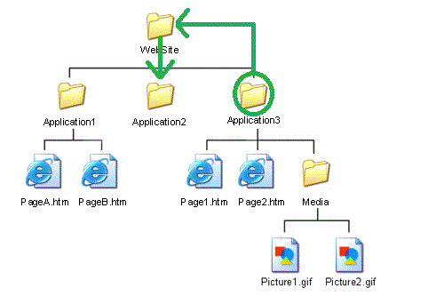

## SMNG's BASIC (BLAB And SMAC Intro to Computing) series
### Worksheet A: intro to using the command line 
 
#### Skills introduced: 
* Basic navigation and listing
* Paths and directory structure
* Altering the directory structure from the command line

----------------------------------------------------------------------------------
#### Before going through this worksheet, you should:
* Have a github account. If not, create one, and tell Robin so that you can add your own files to this repository. 
* Have installed either git bash (if you are on a PC) or know how to open the terminal (mac). If you don't have this, [here is a guide](https://kb.wisc.edu/smng/internal/106101)
----------------------------------------------------------------------------------
### Basic navigation and listing

#### 1. Open git bash (PC) or your command line (terminal program, mac). 
#### 2. When you open an instance of your command line, you will automatically start in your "home" folder. 
That folder varies from computer to computer, so you might want to ask your command line to print out where you currently are located. To do that, type the following command into your terminal and hit enter: 

`pwd` 

This stands for "**p**rint **w**orking **d**irectory". Your working directory is where you currently are "doing work". 

#### 3. Say you want to switch into a different directory, but you don't know what all folders exist in your working directory. You can find out: 

`ls` 

This "**l**i**s**ts" the contents of your current directory. 

#### 4. Now that we know what directories (folders) exist, we can move into one! 
Pick a directory. Directories should have a / after the name; files should have their file extension (.mat, .doc, .pdf, etc.). 

`cd DirectoryName`

Where you put in the name of your directory instead of DirectoryName. If you get back an error, some common culprits:
* There is a typo in your directory's name (every little thing matters)
* There is a space in your directory name, and command line doesn't like that. Try putting quotes around "Your Directory Name", e.g. 

`cd "Actual Final Drafts"`

(cd stands for **c**hange **d**irectory)

#### 5. Now type `pwd` again. 
Your new working directory should be the directory you just moved into. 
#### 6. You can go infinitely downward into folders using just `cd` and directory names, but what if you wanted to move into the folder that CONTAINS your working directory? 
The command line uses `..` to denote moving up a folder. Try this, to get back into your original working directory: 

`cd ../`

If you type in `pwd` again and hit enter, you should get your original working directory. 

#### 7. As you found out in item 3, `ls` simply lists the contents of your working directory, but doesn't list the contents of other directories contained in your directory. 
But you can actually list the contents of other directories if you put the name of the directory after `ls`, like you did for `cd`. For example, using the same directory name that you used in item 6, enter: 

`ls DirectoryName`

This should list the contents of the directory with DirectoryName. 

#### 8. Check your understanding! 
You can also combine the `..` functionality with ls to list the contents of a directory higher up in the tree. What would this command look like?
a. First, change directory into your chosen DirectoryName. 
b. Then, using `ls` and the `..` functionality, list the contents of the directory you were previously in. (You can play around until you get this) 

-------
### Paths and directory structure

#### 9. So far, we've just been navigating between two folders. But there are tons of directories! What if you want to switch to a folder that is not immediately related to the folder you're currently in, or containing the folder you're in? Here it is important to understand paths. 

A path specifies the exact location in your computer's directory structure for any file or directory. It is called "path" because when you are navigating in your directory structure, you have to tell your computer exactly what PATH to take to get to the directory/file you want. 

First, let's get to your comppedagogy folder (if you haven't got this already, visit [this page](https://kb.wisc.edu/smng/internal/106139) to figure out how to do that). If you are on a PC, enter: 

`cd C:/Users/yourusername/Documents/comppedagogy` 

If you are on a Mac, enter: 

`cd ~/Documents/comppedagogy`

What we've just done is provide the command line with the FULL path---to use an analogy you're more familiar with, it has the "address" including all information from the country to house number. 

#### 10. However, you don't need to provide the full path to things all the time. You've already experimented with this, using `..` and `cd DirectoryName`. You just need to tell the command line which path to take from the location you currently are. Take a look at this picture: 

This is a really simple example of what folder structure looks like. At the top we have the folder WebSite, which contains three folders: Application1, Application2, Application3. Application3 also contains two files and the folder Media, and Media contains two picture files. 

Say we are in the folder Application3, and want to get to Picture2.gif. The path is pretty straightforward: first we want to go to Media, then to Picture2.gif. We already know that we can `cd` into a folder that is contained by your current working directory without any fancy path stuff, just using `DirectoryName`. So the path here would be

`Media/Picture2.gif` 

(This won't work on your computer because you don't actually have these folders)

#### 11. If we wanted to go to a folder that isn't directly contained in your working directory, we have to give a more complicated path. 
So say again that we're starting in Application3, and want to go to its "sister" folder, Application2. First we have to go up to WebSite:
 
`cd ../`

And then we can go down to Application2. 

`cd Application2`

Fortunately you don't actually have to move one step with cd every time! You can combine these two commands into one. Assuming we're back in Application2, the combined command would be: 

`cd ../Application2`

You can see this path at work in this picture: 

#### 12. Check your understanding! 
If you were in Application2, how would you access PageB.htm? 

#### 13. Try it out on your own computer! 
a. Make sure you are in your comppedagogy folder (what is the command to print your working directory?)  
b. Using the command line, navigate into the folder called **welcomeToTheLabyrinth**. This folder is contained in **00_remote_worksheets**, which is contained in **comppedagogy**. Verify where you are by using your print working directory command.  
c. From welcomeToTheLabyrinth, navigate into **whichWhich**. This folder is a *sister* folder to welcomeToTheLabyrinth.  
d. Now navigate back into **comppedagogy**. Can you do this in just one command?  

*Note: if you have a computer with multiple drives, switch with cd /letter, i.e. to get to the M: drive, cd /m (for git bash), or cd /Volumes if you are on a Mac.*

-------
### Altering the directory structure from the command line

#### 14. Moving yourself around using the command line is cool, but it's not really that USEFUL. The command line has many other functions, such as making a new directory.
a. First, navigate into the comppedagogy folder.   
b. Then run the following command, substituting your own name for "robin" (*note: if you have a name that is shared with someone else in the lab, the folder may already exist. Use an initial or a nickname to make your new directory*):   

`mkdir robinsNewDirectory` 

mkdir: **m**a**k**e **dir**ectory. Note that you're using the same path specification that you've used in previous commands! You're creating this directory in the directory you're currently in. 

#### 15. Whoops, you put this directory in the wrong spot! You want it in the directory above the one you're currently in, which is Documents. We can do that too: 

`mv robinsNewDirectory ../` 

mv = **m**o**v**e. This command is unique compared to the other ones you've used before because it takes TWO arguments (arguments let a command know exactly how to perform its task): 
a. the path to the thing you want to move (here just `robinsNewDirectory`)  
b. the path to the place you want to move it (here, the folder above you, i.e. `..`)  

#### 16. Check your understanding!
It turns out you were right to begin with, you did want it in the comppedagogy (the folder you're currently in). How do you move it back? Some hints: 
a. Remember that you have to specify the path to the folder you want to move, and your folder has changed location since you last referenced it  
b. `../` references the folder ABOVE you. To reference the folder you're currently in, use `./`   

#### 17. `mv` also performs a slightly different function. 
a. First, enter the command in the command line to get the list of items in your working directory (which should be comppedagogy)   
b. Make sure that your new directory is in there, and that there is no directory called **whatDoesThisDo** (if there is, you can go into your file explorer and delete that folder manually)   
c. Substituting your new directory name for `robinsNewDirectory`, enter:   

`mv robinsNewDirectory whatDoesThisDo` 

4. Enter the command to list the items in your working directory. Where is your new directory? Where is **whatDoesThisDo**? 

So `mv` can rename things as well! Note that this stems from how paths work. Renaming and moving are actually the same thing---you're changing the "address" of the object. 

#### Check your understanding: 
Using the command line, rename the new directory **whatDoesThisDo** to your original directory name (like robinsNewDirectory)

#### 18. When you've got your folder back to its original position in comppedagogy, enter the following two commands: 

`ls`
`mv robinsNewDirectory iContainMultitudes`

(Again substituting your own folder name in for robinsNewDirectory). Where is your directory? Why do you think this is different from what you did in 17? 

#### 19. Okay, now we're done with these directories. You can remove them with the command line as well, with rmdir (ReMove DIRectory). For example, try making a pointless folder: 

`mkdir aPointlessFolder`

List the files in your directory to make sure it exists. Then, 

`rmdir aPointlessFolder`

And list again. The pointless folder should be gone! 

#### 20. Now we can remove your folder, which is currently in iContainMultitudes. 
Unlike other commands, *rmdir isn't really a command you want to test and play around with*: you should do it correctly the first time. However, comppedagogy is a safe sandbox and if you delete something we can always put it back with git (which you will learn about in the next worksheet). Here are hints to make sure you get it right the first time: 

a. You must use the exact path to the exact file or directory you want to remove  
b. You cannot "stack" commands, like how we did `cd ../` followed by `cd Application2`. Instead, you must do it all in one command, like `cd ../Application2`. If you do the command piecemeal, you will end up deleting the folder that contains your target folder!   

This should be all the information you need to run this command correctly the first time! But for the faint of heart, the answer is below the bullet points

*  
* 
* 
*
*
*
*
*
*
*
*
*
*
*
*
*
*
*
*
*
*
*
*
*
*
*
*
*
*
*
*
*
*
*
*

`rmdir iContainMultitudes/robinsNewDirectory`

Originally presented by Robin Karlin and Sarah Bakst on February 12, 2020.
Subsequent edits by Robin Karlin and Chris Naber (February 2021) 
