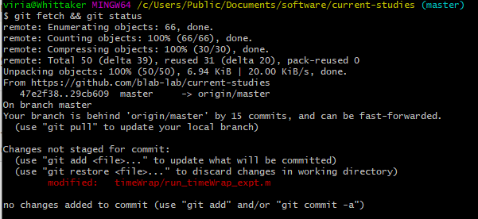

## SMNG's BASIC (BLAB And SMAC Intro to Computing) series
### Worksheet B: git and vim
 
#### Skills introduced: 
* Creating text files from the command line using vim
* Git basics
  * Git add, commit, push
  * Basic git etiquette

----------------------------------------------------------------------------------
#### Before going through this worksheet, you should:
* Be added to the comppedagogy repo by one of the BASIC leaders 
* Have cloned the comppedagogy repo to your computer
----------------------------
### Introduction to vim

#### 1. Last week, we created directories with the command mkdir, but then deleted it. 
a. Navigate to comppedagogy in your command line interface  
b. Make your own directory again (check worksheet A if you have forgotten how to do this)  

#### 2. Now we are going to create a new text file without ever leaving the command line! 
We are going to use a program called vi. It's best to think of this program as one where you are telling someone else to do the writing for you, like "now we are going to write some text! Now we are going to save! Now we are going to write some text again!" Once you are familiar with the program, you'll see how it can be a convenient tool that avoids some weird things like ghost characters that notepad or other programs can introduce. Anyway, end vi talk. 

The basic command structure is `vi` plus the name of the file you want to create (remember that this name is actually a **path**)

`vi myfirstvi_Bakst.txt`

This will open up vi in your command line. 

#### 3. When you first open up vi, you are in command mode. That is, vi accepts commands, which are combinations of characters. To enter commands, type the given combinations and hit enter (except escape, which does not require an enter key).

`i`
This will take you into "**i**nsert" mode. Now vi will know that the keys you are typing are intended to create text in your document rather than send commands to the program.
You'll see `--INSERT--` appear at the bottom left corner of the window. I am currently writing this in vi, so that is what I see at the bottom left corner of my own terminal window. 

Type whatever you want, e.g. "vi is the best!" 

`esc` 
Will get you out of the editing mode and back into command mode. (That is the escape key, not the letters "esc") 

`:w`
This will save what you just wrote. The colon is important! So is the lower case w! (w stands for "write"). 

`:q`
This will **q**uit vim. (again, colon and lowercase q are important). 

The file has gone away! But where am I? Check the contents of the current directory. 

#### 4. Check your understanding (and memory)!
How would you move this file to be inside your directory, instead of in comppedagogy? (You should do this!) 

#### 5. Awesome, you created a file where you wanted it! But how do you share this file with other people in the lab? And what if you want to see your file on a different computer? 

-----------------
### Enter Github 

In SMNG we keep all our experiment code in a git repository ("repo"). Github is a way of sharing your code with other people. There is a "master" version hosted by Git, as well as your own local version ("head"), located on your computer. This way, you can make some changes to code without everybody immediately being affected; the changes that you make on your local machine have to be "pushed" into the master in order for it to be accessible to others. (This is different from keeping things on a server that is directly accessed by multiple computers, like how we store our data.) 

#### 6. Etiquette is very important, especially when you are working with a repo that has a lot of people reading and writing files. 
This is because multiple people may be working on the same bit of code. For example: 

* I've written the function gen_ostUserEvents_timeAdapt, and pushed it to the master repo. Chris is using it and notices a bug: 

`expt.name = 'tmieAdapt'`; --> should be `expt.name = 'timeAdapt';` 

* He fixes it and saves it to his computer, and pushes the fixed version to the master. The next day, I come in and immediately start using the script, but without checking if there's a new version on the master repo. As I'm using the script, I notice another bug: 

`dummyWord = 'caper'`; ---> should be `dummyWord = 'capper'; `

* I fix this and save it to my computer. Then I try to push it to the master repo, but there's a problem! When Git compares the master version to my version, it notices that it is different in more places than what I just fixed. This is called a "conflict". This conflict can be avoided by practicing good Git etiquette (getiquette!). 

#### 7. Best practices: 
a. When you sit down to work on something, first check if there are any updates to the master (bad Robin!). Git commands are prefaced with "git": 

`git status`

You can try this when you're in comppedagogy! This command tells you if you are ahead or behind by certain commits, and if you have any files hanging out waiting to be committed. 

b. Sometimes git status is a little lazy and doesn't go out and check if someone else makes changes. You can think about this like if you are asking your roommate if there was any mail today. Maybe they checked at 9 am, but not since. They might say that there wasn't any mail---but that was actually the last time they checked, and their info might be out of date. To get the latest information you have to actually go to the mailbox and check if anything has been left since the last time you checked. 

`git fetch`

This forces it to "go out to the mailbox" 

`git status`

And report back what it just found. (You can also string these two commands together using `&&`: `git fetch && git status`) 

c. You might be behind the master repo by some number of commits. This means that someone else has committed to the master repo since the last time you looked. In the picture below it says that our branch is behind origin/master by 15 commits, and can be fast-forwarded

To do this, enter the command 

`git pull`

(Since we already asked you to do a pull at the beginning of class, you probably won't have anything new now.)

d. When you are done working for the day, do another check for changes to the master, and then push your changes (we will do the actual commands for this later). 

#### 8. Now suppose you want to track changes to the text file you just made, and make sure that this version appears on the computer of everyone who wants to have access to everything in the repository. Github needs to track the file, and to do that, it needs to know the existence of it.

`git add RobinsDirectory/myfirstvi_NAME.txt` 

This "adds" your version of the file to the staging area so it can be put into the master repo. 

#### 9. Now you need to "commit" your change, or get it ready to send off to the repository. You must also add a message (with the -m "flag") saying what new changes there are to the file. This is important for tracking changes to the file over time.

`git commit -m 'created my first file in vi'`

You must use quotes around your message (in git bash you can also use double quotes, "created my first file"). Don't use an apostrophe in the message itself. 

#### 10. Ok, time to send off your changes! 
A "push" takes whatever is in your own local version of the repository and essentially overwrites what's in the repository online. 

`git push`

*Note: Before you start an add-commit-push process, you should pull first. That will help guard against having to do merges if someone else has worked on files in between the time you started working (when you probably did a pull to get in all the changes since the last time you worked) and the time you are adding your own files. So the full process should be:*

a. You get on your computer. 

`git fetch && git status`

b. Read the message to see if it is telling you anything odd (e.g. if someone else forgot to push their changes on the lab computer before). Typically you will see how many commits you are behind. 

`git pull`

c. Do your work  
d. Push your work. 

`git fetch && git status`  
(`git pull`) 
`git add FILENAMES` 
`git commit -m "my most informative message"` 
`git push`

#### 11. Now try making changes to your text file. Follow the commands in steps 2-3. 
The steps remain the same even though that file already exists. Remember to type "i" to "insert" text! You can also try deleting some text and then pushing those changes.

#### 12. After you have toyed around editing and pushing, go to https://github.com/blab-lab/comppedagogy. 
Do you see the commit messages in the second column? Try clicking on one and see how github represents the commit history.

-----------------
### You are now ready to proceed to [Worksheet C](http://github.com/blab-lab/comppedagogy/blob/master/00_remote_worksheets/worksheetC.md)

------------------
### MORE FUN WITH VI ###
Excited about vi? See more on basic commands here: https://www.cs.colostate.edu/helpdocs/vi.html and some fancier things here: https://www.ccsf.edu/Pub/Fac/vi.html

### NOT EXCITED ABOUT VI? ###
Vi is excited about you! Vi is the default text editor that pops up on the lab computers if you need to complete a **merge** (merge commits from different people into one big commit). 

### For more practice with Git ###
https://kb.wisc.edu/smng/internal/106230

