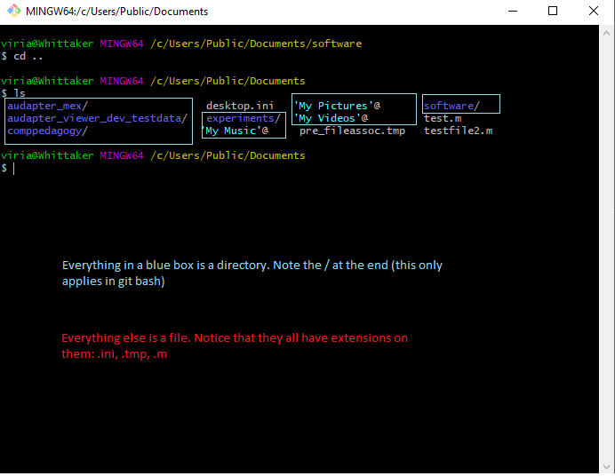
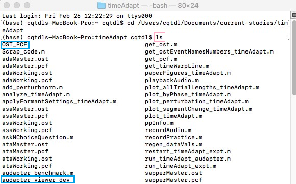
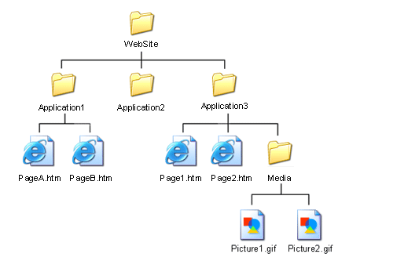
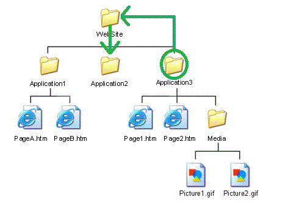

## SMNG's BASIC (BLAB And SMAC Intro to Computing) series
### Worksheet A: intro to using the command line 
 
#### Skills introduced: 
* Basic navigation and listing
* Paths and directory structure

----------------------------------------------------------------------------------
#### Before going through this worksheet, you should:
* Have a Mathworks account, and have accepted the invitation to the online MATLAB drive comppedagogy. 
* Have access to git bash (Windows) or have opened the program called 'terminal' (mac). SMAC and BLAB Lab members: Use git bash on the lab computers.
----------------------------------------------------------------------------------
### Basic navigation and listing

#### 1. Open git bash (PC) or your command line (terminal program, mac).
#### 2. When you open an instance of your command line, you will automatically start in your "home" folder. 
That folder varies from computer to computer, so you might want to ask your command line to print out where you currently are located. To do that, type the following command into your terminal and hit enter: 

`pwd` 

This stands for "**p**rint **w**orking **d**irectory". Your working directory is where you currently are "doing work". 

#### 3. Say you want to switch into a different directory, but you don't know what all folders exist in your working directory. You can find out: 

`ls` 

This "**l**i**s**ts" the contents of your current directory. 

#### 4. Now that we know what directories (folders) exist, we can move into one! 
Pick a directory. Files should have their file extension (.mat, .doc, .pdf, etc.) after them, and directories will either have / after the name (in git bash) or nothing (terminal). Here is an example of what it looks like on git bash (which also color codes them for you!):

And here is an example on terminal. The directories are highlighted in blue. Notice that there is no / on the end of them (unlike git bash) and no color coding. But you can still see that the other things are files because of their extensions (.ost, .pcf, .m are all extensions you'll be getting used to in Matlab!).  

Now you'll learn how to go into one of the directories you saw when you used `ls`. You can change directories with the command `cd`, which stands for **c**hange **d**irectory

`cd DirectoryName`

Run the above command, but put in the name of a real directory intead of "DirectoryName". If you get back an error, some common culprits:
* There is a typo in your directory's name (every little thing matters)
* There is a space in your directory name, and command line doesn't like that. Try putting quotes around "Your Directory Name", e.g. 

`cd "Actual Final Drafts"`

*Still having difficulties? Common characters that mess with command line are ', ", /, $. [Check out this page on escape characters](https://www.shellscript.sh/escape.html).*

#### 5. Now type `pwd` again. 
Your new working directory should be the directory you just moved into. 
#### 6. You can go infinitely downward into folders using just `cd` and directory names, but what if you wanted to move into the folder that CONTAINS your working directory? 
The command line uses `..` to denote moving up a folder. Try this, to get back into your original working directory: 

`cd ../`

If you type in `pwd` again and hit enter, you should get your original working directory. 

#### 7. As you found out in item 3, `ls` simply lists the contents of your working directory, but doesn't list the contents of other directories contained in your directory. 
But you can actually list the contents of other directories if you put the name of the directory after `ls`, like you did for `cd`. For example, using the same directory name that you used in item 6, enter: 

`ls DirectoryName`

This should list the contents of the directory with DirectoryName. 

#### 8. Check your understanding! 
You can also combine the `..` functionality with ls to list the contents of a directory higher up in the tree. What would this command look like?
a. First, change directory into your chosen DirectoryName.  
b. Then, using `ls` and the `..` functionality, list the contents of the directory you were previously in. (You can play around until you get this)  

-------
### Paths and directory structure

#### 9. So far, we've just been navigating between two folders. But there are tons of directories! What if you want to switch to a folder that is not immediately related to the folder you're currently in, or containing the folder you're in? Here it is important to understand paths. 

A path specifies the exact location in your computer's directory structure for any file or directory. It is called "path" because when you are navigating in your directory structure, you have to tell your computer exactly what PATH to take to get to the directory/file you want. 

First, let's open up MATLAB online. The default view will show you your current folder view in the top left panel. You should see comppedagogy in there---if not, [follow this link]([url](https://drive.matlab.com/sharing/412598b7-dd88-4077-9ed7-f9d764e5760c/)) and click "Add to MATLAB Online". You will then see a **command window**: basically MATLAB's command line. There will be a >> on the first line. Type: 

`cd '/MATLAB Drive/comppedagogy'` 

and hit enter. (Don't forget the single quotes!) What we've just done is provide the command window with the FULL path---to use an analogy you're more familiar with, it has the "address" including all information from the country to house number. 

#### 10. However, you don't need to provide the full path to things all the time. You've already experimented with this, using `..` and `cd DirectoryName`. You just need to tell the command line which path to take from the location you currently are. Take a look at this picture: 

This is a really simple example of what folder structure looks like. At the top we have the folder WebSite, which contains three folders: Application1, Application2, Application3. Application3 also contains two files and the folder Media, and Media contains two picture files. 

Say we are in the folder Application3, and want to get to Picture2.gif. The path is pretty straightforward: first we want to go to Media, then to Picture2.gif. We already know that we can `cd` into a folder that is contained by your current working directory without any fancy path stuff, just using `DirectoryName`. So the path here would be

`Media/Picture2.gif` 

(This won't work on your computer because you don't actually have these folders)

#### 11. If we wanted to go to a folder that isn't directly contained in your working directory, we have to give a more complicated path. 
So say again that we're starting in Application3, and want to go to its "sister" folder, Application2. First we have to go up to WebSite:
 
`cd ../`

And then we can go down to Application2. 

`cd Application2`

Fortunately you don't actually have to move one step with cd every time! You can combine these two commands into one. Assuming we're back in Application2, the combined command would be: 

`cd ../Application2`

You can see this path at work in this picture: 

#### 12. Check your understanding! 
If you were in Application2, how would you access PageB.htm? 

#### 13. Try it out on your own! 
a. In MATLAB Online, make sure you are in your comppedagogy folder (what is the command to print your working directory?)  
b. Using the command line, navigate into the folder called **welcomeToTheLabyrinth**. This folder is contained in **worksheets**, which is contained in **comppedagogy**. Verify where you are by using your print working directory command.  
c. From welcomeToTheLabyrinth, navigate into **whichWhich**. This folder is a *sister* folder to welcomeToTheLabyrinth.  
d. Now navigate back into **comppedagogy**. Can you do this in just one command?  

---------------
### Excited about command line? Checkout some cool shortcuts! 
* [Bash, Terminal](https://www.howtogeek.com/howto/ubuntu/keyboard-shortcuts-for-bash-command-shell-for-ubuntu-debian-suse-redhat-linux-etc/)
* [For windows command line](https://www.howtogeek.com/254401/34-useful-keyboard-shortcuts-for-the-windows-command-prompt/) 

---------------
### You are now ready to move onto [Worksheet B](http://github.com/blab-lab/comppedagogy/blob/master/startHere/worksheetB.md)
---------------
Originally presented by Robin Karlin and Sarah Bakst on February 12, 2020. 
Subsequent edits by Robin Karlin and Chris Naber (February 2021) 
