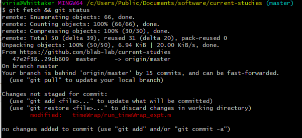

## NeSST's INC (Intro to NeSST Computing) series

### Worksheet C: git and vim

Note: You MUST learn to use Git Bash before using GitHub Desktop. To get approval to use GitHub Desktop, contact the lab manager or Robin. 
 
#### Skills introduced: 
* Making and moving directories
* Cloning repositories
* Creating text files from the command line using vim
* Git basics
  * Git add, commit, push
  * Basic git etiquette

----------------------------------------------------------------------------------
#### Before going through this worksheet, you should:
* Have a GitHub account
* Be added to the comppedagogy repo by the lab manager or Robin
* Have read the first section [here](https://www.notion.so/nesstlabmu/Resources-for-git-and-GitHub-Desktop-6609b345bb3f4f43aaa574399b80dfbb?pvs=4#ed91e70fee074b558cb95c155766b993)
----------------------------
#### 1. Open MATLAB Online
a. Open MATLAB Online on your lab computer.  
b. Using your knowledge of the command line interface from Worksheets A and B, navigate into the comppedagogy folder.

#### 2. The command line has many other functions, such as making a new directory.
a. Navigate into the **moreFolders** folder in comppedagogy.   
b. Then run the following command, substituting your own name for "robin" (*note: if you have a name that is shared with someone else in the lab, the folder may already exist. Use an initial or a nickname to make your new directory*):   

`mkdir robinsNewDirectory` 

mkdir: **m**a**k**e **dir**ectory. Note that you're using the same path specification that you've used in previous commands! You're creating this directory in the directory you're currently in. 

#### 3. Whoops, you put this directory in the wrong spot! You want it in the directory above the one you're currently in, which is comppedagogy. We can do that too: 

`mv robinsNewDirectory ../` 

mv = **m**o**v**e. This command is unique compared to the other ones you've used before because it takes TWO arguments (arguments let a command know exactly how to perform its task): 
a. the path to the thing you want to move (here just `robinsNewDirectory`)  
b. the path to the place you want to move it (here, the folder above you, i.e. `..`)  

#### Check your understanding!
It turns out you were right in the first place; you actually want it in moreFolders. How do you move it there? Some hints: 
a. Remember that you have to specify the path to the folder you want to move, and your folder has changed location since you last referenced it  
b. `../` references the folder ABOVE you. To reference the folder you're currently in, use `./`   

#### 5. `mv` also performs a slightly different function. 
a. First, enter the command in the command line to get the list of items in your working directory (which should be the academic year folder)   
b. Make sure that your new directory is in there, and that there is no directory called **whatDoesThisDo** (if there is, you can use the current folder view to delete that folder manually)   
c. Substituting your new directory name for `robinsNewDirectory`, enter:   

`mv robinsNewDirectory whatDoesThisDo` 

4. Enter the command to list the items in your working directory. Where is your new directory? Where is **whatDoesThisDo**? 

So `mv` can rename things as well! Note that this stems from how paths work. Renaming and moving are actually the same thing---you're changing the "address" of the object. 

#### Check your understanding: 
Using the command line, rename the new directory **whatDoesThisDo** to your original directory name (like robinsNewDirectory)

#### 6. Put your folder back to its original position in comppedagogy, and enter the following two commands: 

`ls`
`mv robinsNewDirectory iContainMultitudes`

(Again substituting your own folder name in for robinsNewDirectory). Where is your directory? Why do you think this is different from what you did in 5? 

#### 7. Okay, now we're done with these directories. You can remove them with the command line as well, with rmdir (ReMove DIRectory). For example, try making a pointless folder: 

`mkdir aPointlessFolder`

List the files in your directory to make sure it exists. Then, 

`rmdir aPointlessFolder`

And list again. The pointless folder should be gone! 

#### 8. Now we can remove your folder, which is currently in iContainMultitudes. 
Unlike other commands, *rmdir isn't really a command you want to test and play around with*: you should do it correctly the first time. However, comppedagogy is a safe sandbox and if you delete something we can always put it back with git. Here are hints to make sure you get it right the first time: 

a. You must use the exact path to the exact file or directory you want to remove  
b. You cannot "stack" commands, like how we did `cd ../` followed by `cd Application2`. Instead, you must do it all in one command, like `cd ../Application2`. If you do the command piecemeal, you will end up deleting the folder that contains your target folder!   

This should be all the information you need to run this command correctly the first time! But for the faint of heart, the answer is below the bullet points

*  
* 
* 
*
*
*
*
*
*
*
*
*
*
*
*
*
*
*
*
*
*
*
*
*
*
*
*
*
*
*
*
*
*
*
*

`rmdir iContainMultitudes/robinsNewDirectory

### Okay, now it's time to get the comppedagogy repo into your lab computer account

#### 1. Prepare your directory
a. Open Git Bash, and navigate into your **personal** documents folder, C:\Users\[username]\Documents, where username is your pawprint 

#### 2. Make a pseudo-lab structure in your personal Documents folder
a. Using your knowledge of the command line interface, make a new folder in your personal documents folder called software  
b. Navigate into this folder 
c. Get a list of the folder contents (it should be empty!) 

#### 3. Get the comppedagogy repo into your lab computer account
You are going to ask Git Bash to get all the information from the main remote branch of the repository. It is the MAIN branch because it is the active one---the default branch that has the main, active code. It is a REMOTE branch because it isn't stored on the computer that you are currently working on. When you do this for the first time on a new computer, you CLONE the repo. That is, you make an exact copy of it on your local computer.  
a. In Git Bash, type `git clone https://www.github.com/nesst-lab/comppedagogy 
b. When the command is done running, get a list of the folder contents again. What is different from the last time you ran this command to this time?  
c. Navigate into the comppedagogy folder. How can you tell that you are in a repo folder, rather than any other folder? (Hint: look at the line in Git Bash that tells you where you are.)  

### Introduction to vim

#### 4. We have practiced creating directories with the command mkdir and then deleting them. 
a. Navigate to comppedagogy in your command line interface  
b. Find the directory named for the current academic year (if you are a returning student, you can use your original folder). E.g. if it is the fall semester of 2021, navigate into the folder 2021-2022.  
c. Make your own directory again (check above if you have forgotten how to do this), then navigate into it.  

#### 5. Now we are going to create a new text file without ever leaving the command line! 
We are going to use a program called vi. It's best to think of this program as one where you are telling someone else to do the writing for you, like "now we are going to write some text! Now we are going to save! Now we are going to write some text again!" Once you are familiar with the program, you'll see how it can be a convenient tool that avoids some weird things like ghost characters that notepad or other programs can introduce. Anyway, end vi talk. 

The basic command structure is `vi` plus the name of the file you want to create (remember that this name is actually a **path**)

`vi myfirstvi_Bakst.txt`

This will open up vi in your command line. 

#### 6. When you first open up vi, you are in command mode. That is, vi accepts commands, which are combinations of characters. To enter commands, type the given combinations and hit enter (except escape, which does not require an enter key).

`i`
This will take you into "**i**nsert" mode. Now vi will know that the keys you are typing are intended to create text in your document rather than send commands to the program.
You'll see `--INSERT--` appear at the bottom left corner of the window. I am currently writing this in vi, so that is what I see at the bottom left corner of my own terminal window. 

Type whatever you want, e.g. "vi is the best!" 

`esc` 
Will get you out of the editing mode and back into command mode. (That is the escape key, not the letters "esc") 

`:w`
This will save what you just wrote. The colon is important! So is the lower case w! (w stands for "write"). 

`:q`
This will **q**uit vim. (again, colon and lowercase q are important). 

The file has gone away! But where am I? Check the contents of the current directory. 

#### 7. Check your understanding (and memory)!
How would you move this file to be inside your directory, instead of in comppedagogy? (You should do this!) 

#### 8. Awesome, you created a file where you wanted it! But how do you share this file with other people in the lab? And what if you want to see your file on a different computer? 

-----------------
### Enter Github 

In the NeSST Lab, we keep all our experiment code in a git repository ("repo"). Github is a way of sharing your code with other people. There is a "main" version hosted by Git, as well as your own local version ("head"), located on your computer. This way, you can make some changes to code without everybody immediately being affected; the changes that you make on your local machine have to be "pushed" into the main in order for it to be accessible to others. (This is different from keeping things on a server that is directly accessed by multiple computers, like how we store our data.) 

#### 9. Etiquette is very important, especially when you are working with a repo that has a lot of people reading and writing files. 
This is because multiple people may be working on the same bit of code. For example: 

* I've written the function gen_ostUserEvents_timeAdapt, and pushed it to the main repo. Chris is using it and notices a bug: 

`expt.name = 'tmieAdapt'`; --> should be `expt.name = 'timeAdapt';` 

* He fixes it and saves it to his computer, and pushes the fixed version to the main. The next day, I come in and immediately start using the script, but without checking if there's a new version on the main repo. As I'm using the script, I notice another bug: 

`dummyWord = 'caper'`; ---> should be `dummyWord = 'capper'; `

* I fix this and save it to my computer. Then I try to push it to the main repo, but there's a problem! When Git compares the main version to my version, it notices that it is different in more places than what I just fixed. This is called a "conflict". This conflict can be avoided by practicing good Git etiquette (getiquette!). 

#### 10. Best practices: 
a. When you sit down to work on something, first check if there are any updates to the main (bad Robin!). Git commands are prefaced with "git": 

`git status`

You can try this when you're in comppedagogy! This command tells you if you are ahead or behind by certain commits, and if you have any files hanging out waiting to be committed. 

b. Sometimes git status is a little lazy and doesn't go out and check if someone else makes changes. You can think about this like if you are asking your roommate if there was any mail today. Maybe they checked at 9 am, but not since. They might say that there wasn't any mail---but that was actually the last time they checked, and their info might be out of date. To get the latest information you have to actually go to the mailbox and check if anything has been left since the last time you checked. 

`git fetch`

This forces it to "go out to the mailbox" 

`git status`

And report back what it just found. (You can also string these two commands together using `&&`: `git fetch && git status`) 

c. You might be behind the main repo by some number of commits. This means that someone else has committed to the main repo since the last time you looked. In the picture below it says that our branch is behind origin/main by 15 commits, and can be fast-forwarded

To do this, enter the command 

`git pull`

(Since we already asked you to do a pull at the beginning of class, you probably won't have anything new now.)

d. When you are done working for the day, do another check for changes to the main, and then push your changes (we will do the actual commands for this later). 

#### 11. Now suppose you want to track changes to the text file you just made, and make sure that this version appears on the computer of everyone who wants to have access to everything in the repository. Github needs to track the file, and to do that, it needs to know the existence of it.

`git add RobinsDirectory/myfirstvi_NAME.txt` 

This "adds" your version of the file to the staging area so it can be put into the main repo. 

#### 12. Now you need to "commit" your change, or get it ready to send off to the repository. You must also add a message (with the -m "flag") saying what new changes there are to the file. This is important for tracking changes to the file over time.

`git commit -m 'created my first file in vi'`

You must use quotes around your message (in git bash you can also use double quotes, "created my first file"). Don't use an apostrophe in the message itself. 

#### 13. Ok, time to send off your changes! 
A "push" takes whatever is in your own local version of the repository and essentially overwrites what's in the repository online. 

`git push`

*Note: Before you start an add-commit-push process, you should pull first. That will help guard against having to do merges if someone else has worked on files in between the time you started working (when you probably did a pull to get in all the changes since the last time you worked) and the time you are adding your own files. So the full process should be:*

a. You get on your computer. 

`git fetch && git status`

b. Read the message to see if it is telling you anything odd (e.g. if someone else forgot to push their changes on the lab computer before). Typically you will see how many commits you are behind. 

`git pull`

c. Do your work  
d. Push your work. 

`git fetch && git status`  
(`git pull`) 
`git add FILENAMES` 
`git commit -m "my most informative message"` 
`git push`

**Best practices note**: If you are making changes to the main branch of a repo, especially code that is "live" (other people are working on it or running it), generally you should only ever push code that is tried and true. If you are not sure or if you haven't finished testing, you should either keep it local on your computer, or push to a development branch. 

#### 14. Now try making changes to your text file. Follow the commands in steps 2-3. 
The steps remain the same even though that file already exists. Remember to type "i" to "insert" text! You can also try deleting some text and then pushing those changes.

#### 15. After you have toyed around editing and pushing, go to https://github.com/nesst-lab/comppedagogy. 
Do you see the commit messages in the second column? Try clicking on one and see how github represents the commit history. 

#### From now on you should push your worksheets into the remote repo. 
-----------------
### You are now ready to proceed to [Worksheet D](http://github.com/nesst-lab/comppedagogy/blob/master/worksheets2/worksheetD.md)

------------------
### MORE FUN WITH VI ###
Excited about vi? See more on basic commands here: https://www.cs.colostate.edu/helpdocs/vi.html and some fancier things here: https://www.ccsf.edu/Pub/Fac/vi.html

### NOT EXCITED ABOUT VI? ###
Vi is excited about you! Vi is the default text editor that pops up on the lab computers if you need to complete a **merge** (merge commits from different people into one big commit). 

### For more practice with Git ###
https://kb.wisc.edu/smng/internal/106230

